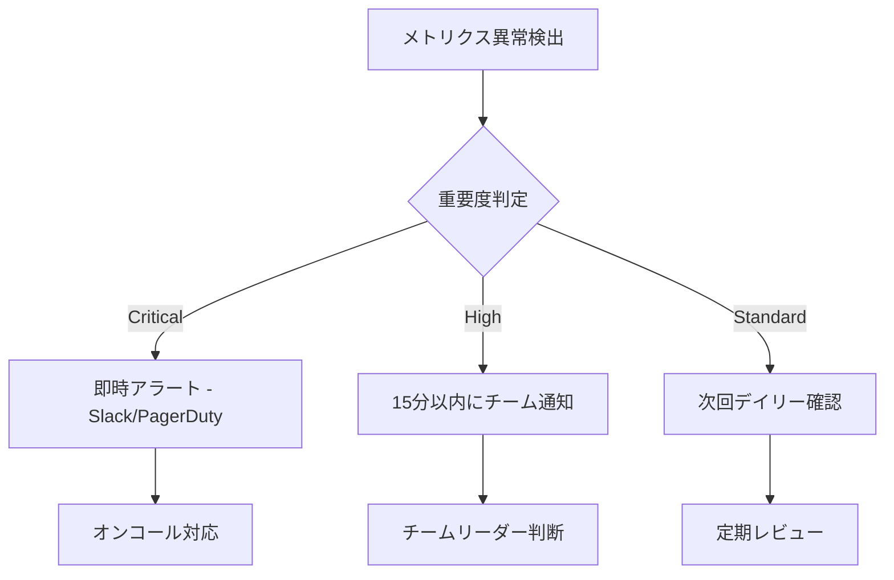

# Agent Performance Metrics

パフォーマンス指標の定義、ベンチマーク基準値、SLA（Service Level Agreement）を文書化します。

## 目次

1. [共通メトリクス](#共通メトリクス)
2. [Coding Agents メトリクス](#coding-agents-メトリクス-7個)
3. [Business Agents メトリクス](#business-agents-メトリクス-14個)
4. [ベンチマーク基準値](#ベンチマーク基準値)
5. [SLA定義](#sla定義)
6. [メトリクス収集方法](#メトリクス収集方法)

---

## 共通メトリクス

全21個のAgentに適用される共通メトリクス定義。

| メトリクス名 | 説明 | 単位 | 目標値 | 警告閾値 | 危険閾値 |
|-------------|------|------|--------|----------|----------|
| `execution_time` | タスク実行にかかった時間 | 秒 (s) | < 120s | > 180s | > 300s |
| `success_rate` | 成功したタスクの割合 | % | > 90% | < 85% | < 70% |
| `retry_count` | リトライ回数 | 回 | < 2 | > 3 | > 5 |
| `error_rate` | エラー発生率 | % | < 5% | > 10% | > 20% |
| `queue_wait_time` | キュー待機時間 | 秒 (s) | < 30s | > 60s | > 120s |
| `memory_usage` | メモリ使用量 | MB | < 512 | > 768 | > 1024 |
| `api_calls` | 外部API呼び出し回数 | 回 | < 10 | > 20 | > 50 |
| `token_usage` | LLMトークン使用量 | tokens | < 50K | > 100K | > 200K |
| `cost_per_task` | タスクあたりのコスト | USD | < $0.10 | > $0.25 | > $0.50 |

### メトリクスの計算式

```typescript
// 成功率
success_rate = (successful_tasks / total_tasks) * 100

// エラー率
error_rate = (failed_tasks / total_tasks) * 100

// 平均実行時間
avg_execution_time = sum(execution_times) / total_tasks

// コスト計算 (Claude Sonnet 4)
cost_per_task = (input_tokens * 0.003 + output_tokens * 0.015) / 1000
```

---

## Coding Agents メトリクス（7個）

### 1. CoordinatorAgent（しきるん）🔴

タスク統括・DAG分解を担当。

| メトリクス | 説明 | 目標値 | 重要度 |
|-----------|------|--------|--------|
| `dag_generation_time` | DAG生成時間 | < 30s | 高 |
| `task_decomposition_accuracy` | タスク分解精度 | > 95% | 高 |
| `parallel_efficiency` | 並列実行効率 | > 70% | 中 |
| `critical_path_optimization` | クリティカルパス最適化率 | > 80% | 中 |
| `agent_assignment_accuracy` | Agent割り当て精度 | > 90% | 高 |
| `dependency_resolution_time` | 依存関係解決時間 | < 10s | 中 |

**KPI計算式:**
```typescript
// 並列実行効率
parallel_efficiency = (total_sequential_time - actual_parallel_time) / total_sequential_time * 100

// クリティカルパス最適化率
critical_path_optimization = (baseline_critical_path - optimized_critical_path) / baseline_critical_path * 100
```

### 2. CodeGenAgent（つくるん）🟢

AI駆動コード生成を担当。

| メトリクス | 説明 | 目標値 | 重要度 |
|-----------|------|--------|--------|
| `code_generation_time` | コード生成時間 | < 60s | 高 |
| `code_quality_score` | 生成コード品質スコア | > 80/100 | 高 |
| `test_coverage` | テストカバレッジ | > 80% | 高 |
| `first_pass_success_rate` | 初回成功率 | > 75% | 中 |
| `lines_of_code_generated` | 生成コード行数 | - | 低 |
| `type_error_rate` | TypeScriptエラー率 | < 5% | 高 |
| `lint_violations` | ESLint違反数 | < 3 | 中 |

**品質スコア計算式:**
```typescript
code_quality_score = (
  type_safety_score * 0.3 +
  test_coverage * 0.3 +
  lint_compliance * 0.2 +
  documentation_score * 0.2
)
```

### 3. ReviewAgent（めだまん）🟢

コード品質判定を担当。

| メトリクス | 説明 | 目標値 | 重要度 |
|-----------|------|--------|--------|
| `review_time` | レビュー完了時間 | < 90s | 中 |
| `issue_detection_rate` | 問題検出率 | > 90% | 高 |
| `false_positive_rate` | 誤検出率 | < 10% | 高 |
| `security_scan_coverage` | セキュリティスキャンカバレッジ | 100% | 高 |
| `quality_score_accuracy` | 品質スコア精度 | > 95% | 高 |
| `suggestions_per_review` | レビューあたり提案数 | 3-10 | 低 |

**スコアリング基準:**
```typescript
// 品質スコアグレード
quality_grade = {
  excellent: score >= 90,  // ⭐ quality:excellent
  good: score >= 80,       // ✅ quality:good
  fair: score >= 60,       // ⚠️ quality:fair
  poor: score < 60         // ❌ quality:poor
}
```

### 4. IssueAgent（みつけるん）🔵

Issue分析・ラベリングを担当。

| メトリクス | 説明 | 目標値 | 重要度 |
|-----------|------|--------|--------|
| `analysis_time` | Issue分析時間 | < 15s | 高 |
| `label_accuracy` | ラベル付け精度 | > 90% | 高 |
| `priority_estimation_accuracy` | 優先度推定精度 | > 85% | 中 |
| `complexity_estimation_accuracy` | 複雑度推定精度 | > 80% | 中 |
| `type_classification_accuracy` | タイプ分類精度 | > 95% | 高 |
| `duplicate_detection_rate` | 重複Issue検出率 | > 70% | 低 |

### 5. PRAgent（まとめるん）🟡

Pull Request自動作成を担当。

| メトリクス | 説明 | 目標値 | 重要度 |
|-----------|------|--------|--------|
| `pr_creation_time` | PR作成時間 | < 30s | 高 |
| `conventional_commits_compliance` | Conventional Commits準拠率 | 100% | 高 |
| `description_quality_score` | 説明文品質スコア | > 80/100 | 中 |
| `linked_issues_accuracy` | Issue紐付け精度 | 100% | 高 |
| `merge_success_rate` | マージ成功率 | > 95% | 高 |
| `review_request_accuracy` | レビュー依頼精度 | > 90% | 中 |

### 6. DeploymentAgent（はこぶん）🟡

CI/CDデプロイ自動化を担当。

| メトリクス | 説明 | 目標値 | 重要度 |
|-----------|------|--------|--------|
| `deployment_time` | デプロイ時間 | < 300s | 高 |
| `deployment_success_rate` | デプロイ成功率 | > 99% | 高 |
| `rollback_time` | ロールバック時間 | < 60s | 高 |
| `health_check_pass_rate` | ヘルスチェック合格率 | > 99% | 高 |
| `zero_downtime_rate` | ゼロダウンタイム率 | > 95% | 高 |
| `environment_sync_time` | 環境同期時間 | < 120s | 中 |

**デプロイメントフェーズ:**
```typescript
deployment_phases = {
  build: { target: '< 60s', weight: 0.2 },
  test: { target: '< 120s', weight: 0.3 },
  deploy: { target: '< 60s', weight: 0.3 },
  healthCheck: { target: '< 60s', weight: 0.2 }
}
```

### 7. TestAgent（たしかめるん）🟢

テスト自動実行を担当。

| メトリクス | 説明 | 目標値 | 重要度 |
|-----------|------|--------|--------|
| `test_execution_time` | テスト実行時間 | < 180s | 中 |
| `test_pass_rate` | テスト合格率 | > 95% | 高 |
| `coverage_achieved` | 達成カバレッジ | > 80% | 高 |
| `flaky_test_rate` | 不安定テスト率 | < 2% | 高 |
| `regression_detection_rate` | リグレッション検出率 | > 95% | 高 |
| `test_generation_quality` | 生成テスト品質 | > 80/100 | 中 |

---

## Business Agents メトリクス（14個）

### 戦略・企画系（6個）

#### 8. AIEntrepreneurAgent（あきんどさん）🔴

包括的ビジネスプラン作成を担当。

| メトリクス | 説明 | 目標値 | 重要度 |
|-----------|------|--------|--------|
| `plan_generation_time` | プラン生成時間 | < 600s | 中 |
| `phase_completion_rate` | フェーズ完了率 | > 90% | 高 |
| `market_analysis_depth` | 市場分析深度 | > 80/100 | 高 |
| `financial_projection_accuracy` | 財務予測精度 | > 70% | 中 |
| `competitor_coverage` | 競合カバレッジ | > 80% | 中 |

#### 9. ProductConceptAgent（ひらめきくん）🔵

プロダクトコンセプト設計を担当。

| メトリクス | 説明 | 目標値 | 重要度 |
|-----------|------|--------|--------|
| `concept_generation_time` | コンセプト生成時間 | < 300s | 中 |
| `usp_clarity_score` | USP明確度スコア | > 85/100 | 高 |
| `market_fit_score` | 市場適合度 | > 80/100 | 高 |
| `innovation_score` | 革新性スコア | > 70/100 | 中 |

#### 10. ProductDesignAgent（せっけいくん）🟢

サービス詳細設計を担当。

| メトリクス | 説明 | 目標値 | 重要度 |
|-----------|------|--------|--------|
| `design_completion_time` | 設計完了時間 | < 480s | 中 |
| `mvp_definition_clarity` | MVP定義明確度 | > 90/100 | 高 |
| `tech_stack_appropriateness` | 技術スタック適切度 | > 85/100 | 高 |
| `content_plan_coverage` | コンテンツ計画カバレッジ | > 80% | 中 |

#### 11. FunnelDesignAgent（みちびきくん）🟢

顧客導線設計を担当。

| メトリクス | 説明 | 目標値 | 重要度 |
|-----------|------|--------|--------|
| `funnel_design_time` | ファネル設計時間 | < 360s | 中 |
| `conversion_optimization_score` | 転換率最適化スコア | > 80/100 | 高 |
| `touchpoint_coverage` | タッチポイントカバレッジ | > 90% | 高 |
| `ltv_projection_accuracy` | LTV予測精度 | > 70% | 中 |

#### 12. PersonaAgent（ひとがたくん）🔵

ターゲット顧客ペルソナ設計を担当。

| メトリクス | 説明 | 目標値 | 重要度 |
|-----------|------|--------|--------|
| `persona_generation_time` | ペルソナ生成時間 | < 240s | 中 |
| `persona_depth_score` | ペルソナ深度スコア | > 85/100 | 高 |
| `journey_map_completeness` | ジャーニーマップ完成度 | > 80% | 高 |
| `empathy_map_quality` | エンパシーマップ品質 | > 80/100 | 中 |

#### 13. SelfAnalysisAgent（じぶんしるん）🔵

キャリア・スキル分析を担当。

| メトリクス | 説明 | 目標値 | 重要度 |
|-----------|------|--------|--------|
| `analysis_time` | 分析時間 | < 180s | 中 |
| `skill_identification_accuracy` | スキル特定精度 | > 85% | 高 |
| `strength_clarity_score` | 強み明確度スコア | > 80/100 | 高 |
| `career_alignment_score` | キャリア適合度 | > 75/100 | 中 |

### マーケティング系（5個）

#### 14. MarketResearchAgent（しらべるん）🔵

市場調査を担当。

| メトリクス | 説明 | 目標値 | 重要度 |
|-----------|------|--------|--------|
| `research_time` | 調査時間 | < 480s | 中 |
| `competitor_count` | 競合分析数 | > 20 | 高 |
| `trend_identification_accuracy` | トレンド特定精度 | > 80% | 高 |
| `data_source_diversity` | データソース多様性 | > 5 | 中 |
| `insight_quality_score` | インサイト品質スコア | > 80/100 | 高 |

#### 15. MarketingAgent（ひろめるん）🟢

マーケティング戦略立案を担当。

| メトリクス | 説明 | 目標値 | 重要度 |
|-----------|------|--------|--------|
| `strategy_generation_time` | 戦略生成時間 | < 360s | 中 |
| `channel_coverage` | チャネルカバレッジ | > 80% | 高 |
| `budget_optimization_score` | 予算最適化スコア | > 80/100 | 高 |
| `roi_projection_accuracy` | ROI予測精度 | > 70% | 中 |

#### 16. ContentCreationAgent（かくちゃん）🟢

コンテンツ制作を担当。

| メトリクス | 説明 | 目標値 | 重要度 |
|-----------|------|--------|--------|
| `content_creation_time` | コンテンツ作成時間 | < 300s | 中 |
| `content_quality_score` | コンテンツ品質スコア | > 80/100 | 高 |
| `seo_optimization_score` | SEO最適化スコア | > 75/100 | 高 |
| `engagement_prediction` | エンゲージメント予測 | > 70% | 中 |
| `brand_consistency_score` | ブランド一貫性スコア | > 90/100 | 高 |

#### 17. SNSStrategyAgent（つぶやきくん）🟢

SNS戦略立案を担当。

| メトリクス | 説明 | 目標値 | 重要度 |
|-----------|------|--------|--------|
| `strategy_time` | 戦略立案時間 | < 300s | 中 |
| `platform_coverage` | プラットフォームカバレッジ | > 3 | 高 |
| `posting_calendar_quality` | 投稿カレンダー品質 | > 80/100 | 高 |
| `hashtag_strategy_score` | ハッシュタグ戦略スコア | > 75/100 | 中 |
| `growth_projection_accuracy` | 成長予測精度 | > 65% | 低 |

#### 18. YouTubeAgent（どうがくん）🟢

YouTube運用最適化を担当。

| メトリクス | 説明 | 目標値 | 重要度 |
|-----------|------|--------|--------|
| `channel_design_time` | チャンネル設計時間 | < 360s | 中 |
| `video_plan_quality` | 動画企画品質 | > 80/100 | 高 |
| `seo_optimization_score` | SEO最適化スコア | > 80/100 | 高 |
| `thumbnail_effectiveness` | サムネイル効果予測 | > 70% | 中 |
| `upload_schedule_optimization` | アップロードスケジュール最適化 | > 80/100 | 中 |

### 営業・顧客管理系（3個）

#### 19. SalesAgent（うりこみくん）🟢

セールスプロセス最適化を担当。

| メトリクス | 説明 | 目標値 | 重要度 |
|-----------|------|--------|--------|
| `sales_process_design_time` | セールスプロセス設計時間 | < 300s | 中 |
| `conversion_rate_optimization` | 転換率最適化スコア | > 80/100 | 高 |
| `script_quality_score` | スクリプト品質スコア | > 85/100 | 高 |
| `objection_handling_coverage` | 反論対応カバレッジ | > 90% | 高 |
| `lead_scoring_accuracy` | リードスコアリング精度 | > 75% | 中 |

#### 20. CRMAgent（つなぐん）🟡

顧客関係管理を担当。

| メトリクス | 説明 | 目標値 | 重要度 |
|-----------|------|--------|--------|
| `crm_design_time` | CRM設計時間 | < 360s | 中 |
| `customer_segmentation_accuracy` | 顧客セグメント精度 | > 85% | 高 |
| `retention_strategy_score` | 維持戦略スコア | > 80/100 | 高 |
| `satisfaction_prediction_accuracy` | 満足度予測精度 | > 70% | 中 |
| `churn_prediction_accuracy` | 離脱予測精度 | > 75% | 高 |

#### 21. AnalyticsAgent（かぞえるん）🔵

データ分析・PDCA実行を担当。

| メトリクス | 説明 | 目標値 | 重要度 |
|-----------|------|--------|--------|
| `analysis_time` | 分析時間 | < 240s | 中 |
| `kpi_identification_accuracy` | KPI特定精度 | > 90% | 高 |
| `dashboard_design_quality` | ダッシュボード設計品質 | > 85/100 | 高 |
| `insight_generation_quality` | インサイト生成品質 | > 80/100 | 高 |
| `recommendation_accuracy` | 提案精度 | > 75% | 中 |

---

## ベンチマーク基準値

### 全体パフォーマンス基準

| レベル | 説明 | 成功率 | 平均実行時間 | コスト効率 |
|--------|------|--------|-------------|-----------|
| **Excellent** | 最高性能 | > 95% | < 60s | < $0.05/task |
| **Good** | 目標達成 | > 90% | < 120s | < $0.10/task |
| **Acceptable** | 許容範囲 | > 80% | < 180s | < $0.20/task |
| **Poor** | 改善必要 | > 70% | < 300s | < $0.50/task |
| **Critical** | 緊急対応 | < 70% | > 300s | > $0.50/task |

### Agent別ベンチマーク

#### Coding Agents

| Agent | 目標実行時間 | 目標成功率 | コスト目標 |
|-------|-------------|-----------|-----------|
| CoordinatorAgent | < 45s | > 95% | < $0.08 |
| CodeGenAgent | < 90s | > 85% | < $0.15 |
| ReviewAgent | < 120s | > 90% | < $0.10 |
| IssueAgent | < 20s | > 95% | < $0.03 |
| PRAgent | < 45s | > 98% | < $0.05 |
| DeploymentAgent | < 300s | > 99% | < $0.02 |
| TestAgent | < 180s | > 95% | < $0.05 |

#### Business Agents

| Agent | 目標実行時間 | 目標成功率 | コスト目標 |
|-------|-------------|-----------|-----------|
| AIEntrepreneurAgent | < 600s | > 90% | < $0.50 |
| ProductConceptAgent | < 300s | > 90% | < $0.20 |
| ProductDesignAgent | < 480s | > 90% | < $0.30 |
| FunnelDesignAgent | < 360s | > 90% | < $0.20 |
| PersonaAgent | < 240s | > 92% | < $0.15 |
| SelfAnalysisAgent | < 180s | > 95% | < $0.10 |
| MarketResearchAgent | < 480s | > 85% | < $0.25 |
| MarketingAgent | < 360s | > 90% | < $0.20 |
| ContentCreationAgent | < 300s | > 88% | < $0.15 |
| SNSStrategyAgent | < 300s | > 90% | < $0.15 |
| YouTubeAgent | < 360s | > 88% | < $0.20 |
| SalesAgent | < 300s | > 90% | < $0.15 |
| CRMAgent | < 360s | > 90% | < $0.20 |
| AnalyticsAgent | < 240s | > 92% | < $0.15 |

---

## SLA定義

### Service Level Agreement

#### Tier 1: Critical（クリティカル）

適用Agent: CoordinatorAgent, DeploymentAgent

| 指標 | 保証値 | 測定期間 |
|------|--------|----------|
| 可用性 | 99.9% | 月間 |
| 応答時間 | < 10s | P95 |
| 成功率 | > 99% | 週間 |
| 復旧時間 | < 5分 | インシデント |

#### Tier 2: High（高優先度）

適用Agent: CodeGenAgent, ReviewAgent, IssueAgent, PRAgent

| 指標 | 保証値 | 測定期間 |
|------|--------|----------|
| 可用性 | 99.5% | 月間 |
| 応答時間 | < 30s | P95 |
| 成功率 | > 95% | 週間 |
| 復旧時間 | < 15分 | インシデント |

#### Tier 3: Standard（標準）

適用Agent: TestAgent, 全Business Agents

| 指標 | 保証値 | 測定期間 |
|------|--------|----------|
| 可用性 | 99.0% | 月間 |
| 応答時間 | < 60s | P95 |
| 成功率 | > 90% | 週間 |
| 復旧時間 | < 30分 | インシデント |

### エスカレーションポリシー



---

## メトリクス収集方法

### 実装アーキテクチャ

```typescript
// packages/coding-agents/monitoring/metrics-collector.ts

interface AgentMetrics {
  agentType: AgentType;
  taskId: string;
  startTime: Date;
  endTime: Date;
  executionTime: number;  // ms
  success: boolean;
  errorType?: string;
  retryCount: number;
  tokenUsage: {
    input: number;
    output: number;
  };
  cost: number;
  customMetrics: Record<string, number>;
}

class MetricsCollector {
  async recordExecution(metrics: AgentMetrics): Promise<void>;
  async getAgentStats(agentType: AgentType, period: TimePeriod): Promise<AgentStats>;
  async getSystemHealth(): Promise<SystemHealthReport>;
  async exportMetrics(format: 'json' | 'csv' | 'prometheus'): Promise<string>;
}
```

### 収集ポイント

1. **タスク開始時**: `startTime`, `taskId`, `agentType`
2. **タスク完了時**: `endTime`, `success`, `errorType`
3. **API呼び出し時**: `tokenUsage`, `cost`, `api_calls`
4. **リトライ時**: `retryCount`, `error_details`
5. **品質評価時**: `quality_score`, `coverage`, etc.

### ストレージ

```sql
-- メトリクステーブル
CREATE TABLE agent_metrics (
  id UUID PRIMARY KEY DEFAULT gen_random_uuid(),
  agent_type VARCHAR(50) NOT NULL,
  task_id VARCHAR(100) NOT NULL,
  start_time TIMESTAMP NOT NULL,
  end_time TIMESTAMP,
  execution_time_ms INTEGER,
  success BOOLEAN DEFAULT false,
  error_type VARCHAR(100),
  retry_count INTEGER DEFAULT 0,
  input_tokens INTEGER DEFAULT 0,
  output_tokens INTEGER DEFAULT 0,
  cost_usd DECIMAL(10, 6),
  custom_metrics JSONB,
  created_at TIMESTAMP DEFAULT CURRENT_TIMESTAMP
);

-- インデックス
CREATE INDEX idx_agent_metrics_type ON agent_metrics(agent_type);
CREATE INDEX idx_agent_metrics_time ON agent_metrics(start_time);
CREATE INDEX idx_agent_metrics_success ON agent_metrics(success);
```

### ダッシュボード統合

メトリクスは以下のダッシュボードで可視化:

- **GitHub Pages**: `https://shunsukehayashi.github.io/Miyabi/dashboard`
- **Prometheus**: `http://localhost:9090/metrics`
- **Grafana**: `http://localhost:3000/d/miyabi-agents`

---

## 関連ドキュメント

- [Agent仕様書](./specs/) - 各Agentの詳細仕様
- [キャラクター図鑑](./AGENT_CHARACTERS.md) - 全21キャラの詳細
- [Entity-Relationモデル](../../docs/ENTITY_RELATION_MODEL.md) - システム全体の関係性
- [監視設定](../../.claude/monitoring/) - 監視システム設定

---

**最終更新**: 2025-12-19
**バージョン**: 1.0.0
**Issue**: #145
