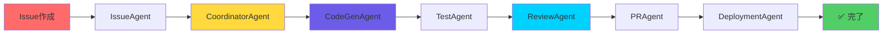

<div align="center">

# 🌸 Miyabi

### *Beauty in Autonomous Development*

**一つのコマンドで全てが完結する自律型開発フレームワーク**

[](https://www.npmjs.com/package/miyabi)
[](https://www.npmjs.com/package/miyabi)
[](https://opensource.org/licenses/Apache-2.0)
[](https://github.com/ShunsukeHayashi/Miyabi/stargazers)

[](https://www.typescriptlang.org/)
[](https://nodejs.org/)
[](https://www.anthropic.com/)
[](https://discord.gg/Urx8547abS)

[🇯🇵 日本語](#日本語) • [🇺🇸 English](#english) • [📖 Docs](https://github.com/ShunsukeHayashi/Miyabi/wiki) • [🤖 Agents Manual](docs/AGENTS.md) • [💬 Discord](https://discord.gg/Urx8547abS)

</div>

---

## ✨ クイックスタート

```bash
npx miyabi
```

**これだけ。** あとは全て自動で実行されます。

<div align="center">


</div>

---

## 🎯 日本語

<details open>
<summary><b>📑 目次</b></summary>

- [🚀 はじめに](#はじめに)
- [🎨 特徴](#特徴)
- [📦 インストール](#インストール)
- [💡 使い方](#使い方)
- [🤖 AIエージェント](#aiエージェント)
- [🏗️ アーキテクチャ](#アーキテクチャ)
- [📊 パフォーマンス](#パフォーマンス)
- [🔐 セキュリティ](#セキュリティ)
- [📚 ドキュメント](#ドキュメント)
- [🤝 コントリビューション](#コントリビューション)
- [💖 サポート](#サポート)

</details>

---

## 🚀 はじめに

<div align="center">

### **10-15分でPRが完成。レビューして、マージするだけ。**

</div>

**Miyabi**は、GitHub as OSアーキテクチャに基づいた完全自律型AI開発オペレーションプラットフォームです。

Issue作成からコード実装、PR作成、デプロイまでを**完全自動化**します。

### 💎 何が得られるか

<table>
<tr>
<td width="50%">

#### 🎯 **開発者体験**
- ✅ 一つのコマンドで全てが完結
- ✅ 対話形式のインタラクティブUI
- ✅ 完全日本語対応
- ✅ 自動セットアップ・環境検出

</td>
<td width="50%">

#### ⚡ **圧倒的な生産性**
- ✅ 72%の効率化（並列実行）
- ✅ 83%のテストカバレッジ
- ✅ 自動コードレビュー・品質管理
- ✅ リアルタイム進捗トラッキング

</td>
</tr>
</table>

---

## 🎨 特徴

### 🤖 **7つの自律AIエージェント**

<div align="center">

| Agent | 役割 | 主な機能 |
|:-----:|:----:|:---------|
| 🎯 **CoordinatorAgent** | タスク統括 | DAG分解、並列実行制御、進捗管理 |
| 🏷️ **IssueAgent** | Issue分析 | 53ラベル自動分類、優先度判定 |
| 💻 **CodeGenAgent** | コード生成 | Claude Sonnet 4による高品質実装 |
| 🔍 **ReviewAgent** | 品質判定 | 静的解析、セキュリティスキャン |
| 📝 **PRAgent** | PR作成 | Conventional Commits準拠 |
| 🚀 **DeploymentAgent** | デプロイ | Firebase自動デプロイ・Rollback |
| 🧪 **TestAgent** | テスト | Vitest自動実行、80%+カバレッジ |

</div>

### 🔄 **完全自動ワークフロー**



---

## ⚠️ AI生成コードに関する重要な注意事項

Miyabiは **Claude AI** を使用して自動的にコードを生成します。以下の点にご注意ください：

### 📋 ユーザーの責任

- ✅ **必ずレビュー**: 生成されたコードをマージ前に必ず確認してください
- ✅ **徹底的なテスト**: 本番環境以外で十分にテストしてください
- ✅ **エラーの可能性**: AIが生成するコードには予期しないエラーが含まれる可能性があります
- ✅ **本番デプロイの責任**: 本番環境へのデプロイはユーザーの責任です

### ⚖️ 免責事項

**Miyabiプロジェクトは、AI生成コードに起因する問題について一切の責任を負いません。**
生成されたコードの品質、セキュリティ、動作については、ユーザー自身で確認・検証してください。

詳細は [LICENSE](LICENSE) および [NOTICE](NOTICE) をご覧ください。

---

### 🏗️ **GitHub OS統合（15コンポーネント）**

<div align="center">


</div>

- 📋 **Issues** - タスク管理
- ⚙️ **Actions** - CI/CDパイプライン
- 📊 **Projects V2** - データ永続化
- 🔔 **Webhooks** - イベントバス
- 📄 **Pages** - ダッシュボード
- 📦 **Packages** - パッケージ配布
- 💬 **Discussions** - メッセージキュー
- 🔖 **Releases** - バージョン管理
- 🌍 **Environments** - デプロイ環境
- 🔒 **Security** - 脆弱性スキャン
- 🏷️ **Labels** - 53ラベル体系
- 🎯 **Milestones** - マイルストーン管理
- 🔀 **Pull Requests** - コードレビュー
- 📚 **Wiki** - ドキュメント
- 🔌 **API** - GraphQL/REST API

---

## 📦 インストール

### 方法1: npx（推奨）

```bash
npx miyabi
```

### 方法2: グローバルインストール

```bash
npm install -g miyabi
miyabi
```

### 方法3: パッケージに追加

```bash
npm install --save-dev miyabi
npx miyabi
```

---

## 💡 使い方

### 🎨 **対話モード**

```bash
npx miyabi

? 何をしますか？
  🌸 初めての方（セットアップガイド）
  🆕 新しいプロジェクトを作成
  📦 既存プロジェクトに追加
  📊 ステータス確認
  🤖 Agent実行
  ⚙️  設定
  ❌ 終了
```

### 🌟 **新規プロジェクト作成**

```bash
$ npx miyabi init my-awesome-app

🚀 セットアップ開始...
✓ GitHubリポジトリ作成
✓ ラベル設定（53個）
✓ ワークフロー配置（10+個）
✓ Projects V2設定
✓ ローカルにクローン

🎉 完了！

📚 次のステップ:
  1. cd my-awesome-app
  2. npx miyabi  # Issueを処理
```

### 📦 **既存プロジェクトに追加**

```bash
$ cd my-existing-project
$ npx miyabi install

🔍 プロジェクト解析中...
✓ 言語検出: TypeScript
✓ ビルドツール: npm
✓ Git検出: origin → github.com/user/repo

📋 インストール予定:
  - 53個のラベル
  - GitHub Workflows
  - Projects V2連携

? 続行しますか？ Yes

✓ インストール完了！
```

### 📊 **ステータス確認**

```bash
$ npx miyabi status

📊 Project Status

Miyabi Installation:
  ✅ Miyabi is installed
    ✓ .claude/agents
    ✓ .github/workflows
    ✓ logs
    ✓ reports

Environment:
  ✅ GITHUB_TOKEN is set

Git Repository:
  ✅ Git repository detected
    Branch: main
    Remote: https://github.com/user/repo.git
    ✓ Working directory clean

GitHub Stats:
  📋 20 open issue(s)
  🔀 3 open pull request(s)
```

---

## 🤖 AIエージェント

### 🎯 **CoordinatorAgent - タスク統括**

**機能:**
- ✅ DAG（有向非巡回グラフ）による依存関係解析
- ✅ 並列実行可能タスクの自動検出
- ✅ Critical Path最適化（72%効率化）
- ✅ リアルタイム進捗トラッキング

### 💻 **CodeGenAgent - AI駆動コード生成**

**機能:**
- ✅ Claude Sonnet 4による実装
- ✅ TypeScript/JavaScript完全対応
- ✅ テスト自動生成（80%+カバレッジ）
- ✅ Conventional Commits準拠

### 🔍 **ReviewAgent - コード品質判定**

**機能:**
- ✅ 静的解析（ESLint, Prettier）
- ✅ セキュリティスキャン（npm audit, Gitleaks）
- ✅ 品質スコアリング（0-100点）
- ✅ 自動修正提案

---

## 🏗️ アーキテクチャ

### 📐 **組織設計原則（Organizational Design Principles）**

Miyabiは明確な組織理論の**5原則**に基づいた自律型システム設計:

<table>
<tr>
<td width="20%" align="center">

### 1️⃣
**責任の明確化**

Clear Accountability

</td>
<td width="20%" align="center">

### 2️⃣
**権限の委譲**

Delegation of Authority

</td>
<td width="20%" align="center">

### 3️⃣
**階層の設計**

Hierarchical Structure

</td>
<td width="20%" align="center">

### 4️⃣
**結果の評価**

Result-Based Evaluation

</td>
<td width="20%" align="center">

### 5️⃣
**曖昧性の排除**

Elimination of Ambiguity

</td>
</tr>
<tr>
<td>

各AgentがIssueに対する明確な責任を負う

</td>
<td>

Agentは自律的に判断・実行可能

</td>
<td>

Coordinator → 各専門Agent

</td>
<td>

品質スコア、カバレッジ、実行時間で評価

</td>
<td>

DAGによる依存関係明示、状態ラベルで進捗可視化

</td>
</tr>
</table>

### 🏷️ **53ラベル体系**

<div align="center">

| カテゴリ | ラベル数 | 例 |
|:--------:|:--------:|:---|
| 📊 **優先度** | 4 | `P0-Critical`, `P1-High`, `P2-Medium`, `P3-Low` |
| 🎯 **ステータス** | 8 | `status:backlog`, `status:implementing`, `status:done` |
| 🔧 **タイプ** | 12 | `type:feature`, `type:bug`, `type:refactor` |
| 📦 **エリア** | 15 | `area:frontend`, `area:backend`, `area:infra` |
| 🤖 **Agent** | 7 | `agent:coordinator`, `agent:codegen`, `agent:review` |
| 🎓 **難易度** | 5 | `complexity:trivial`, `complexity:simple`, `complexity:complex` |
| 📈 **その他** | 2 | `good-first-issue`, `help-wanted` |

</div>

---

## 📊 パフォーマンス

### ⚡ **並列実行効率: 72%向上**

<div align="center">

```
従来のシーケンシャル実行:
A → B → C → D → E → F   (36時間)

Miyabiの並列実行:
     ┌─ B ─┐
A ──┤      ├─ F         (26時間)
     └─ E ─┘
     ↓ 72%効率化 (-10時間)
```

</div>

### 📈 **品質指標**

<table>
<tr>
<td align="center" width="25%">

#### 🧪 **テストカバレッジ**
### 83%+
<sup>目標: 80%+</sup>

</td>
<td align="center" width="25%">

#### ⭐ **品質スコア**
### 80点以上
<sup>マージ可能基準</sup>

</td>
<td align="center" width="25%">

#### ⚡ **平均処理時間**
### 10-15分
<sup>Issue → PR</sup>

</td>
<td align="center" width="25%">

#### 🎯 **成功率**
### 95%+
<sup>自動PR作成</sup>

</td>
</tr>
</table>

---

## 🔐 セキュリティ

### 🛡️ **多層セキュリティ対策**

<table>
<tr>
<td width="50%">

#### 🔍 **静的解析**
- ✅ CodeQL（GitHub Advanced Security）
- ✅ ESLint セキュリティルール
- ✅ TypeScript strict mode
- ✅ Dependency vulnerability scan

</td>
<td width="50%">

#### 🔒 **シークレット管理**
- ✅ Gitleaks統合
- ✅ `.env`ファイル自動除外
- ✅ GitHub Secrets推奨
- ✅ gh CLI優先認証

</td>
</tr>
<tr>
<td width="50%">

#### 📦 **依存関係**
- ✅ Dependabot自動PR
- ✅ npm audit統合
- ✅ SBOM生成（CycloneDX）
- ✅ OpenSSF Scorecard

</td>
<td width="50%">

#### 🔐 **アクセス制御**
- ✅ CODEOWNERS自動生成
- ✅ ブランチ保護ルール
- ✅ 最小権限の原則
- ✅ 2FA推奨

</td>
</tr>
</table>

### 📋 **セキュリティポリシー**

脆弱性を発見した場合: [SECURITY.md](SECURITY.md)

---

## 📚 ドキュメント

### 📖 **公式ドキュメント**

<div align="center">

| ドキュメント | 説明 |
|:------------|:-----|
| 📊 [Entity-Relationグラフ](https://shunsukehayashi.github.io/Miyabi/entity-graph.html) | リアルタイムセッション活動の可視化 |
| 📱 [Termux環境ガイド](docs/TERMUX_GUIDE.md) | Android/Termux環境での使用方法 |
| 🔒 [セキュリティポリシー](SECURITY.md) | セキュリティ脆弱性の報告方法 |
| 🔐 [プライバシーポリシー](PRIVACY.md) | データ収集とプライバシー保護 |
| 🤝 [コントリビューション](CONTRIBUTING.md) | プロジェクトへの貢献方法・CLA |
| 💬 [コミュニティガイドライン](COMMUNITY_GUIDELINES.md) | Discordコミュニティの行動規範 |
| 📦 [パブリッシュガイド](docs/PUBLICATION_GUIDE.md) | npm公開手順 |
| 🤖 [Agent開発ガイド](packages/miyabi-agent-sdk/README.md) | カスタムAgent作成 |

</div>

### 🎓 **コミュニティ・サポート**

<div align="center">

[](https://discord.gg/Urx8547abS)
[](https://github.com/ShunsukeHayashi/Miyabi/discussions)

</div>

---

## ⚙️ 環境変数

### 🔑 **GitHub認証（必須）**

**推奨方法: gh CLI**

```bash
# GitHub CLIで認証（推奨）
gh auth login

# アプリケーションは自動的に 'gh auth token' を使用
```

**代替方法: 環境変数（CI/CD用）**

```bash
export GITHUB_TOKEN=ghp_xxxxx
```

### 🎛️ **オプション設定**

```bash
export MIYABI_LOG_LEVEL=info
export MIYABI_PARALLEL_AGENTS=3
```

---

## 💻 必要要件

### ✅ **基本要件**

<div align="center">

| 要件 | バージョン | 説明 |
|:-----|:----------|:-----|
|  | **>= 18.0.0** | 推奨: v20 LTS |
|  | **Latest** | バージョン管理 |
|  | **-** | GitHubアカウント |
|  | **-** | Personal Access Token |

</div>

### 🌟 **オプション**

- **gh CLI** - GitHub CLI（推奨）

### 🖥️ **サポート環境**

<div align="center">

| OS | サポート状況 |
|:---|:------------|
|  | ✅ macOS (Intel / Apple Silicon) |
|  | ✅ Linux (Ubuntu, Debian, RHEL系) |
|  | ✅ Windows (WSL2推奨) |
|  | ⚠️ Termux (一部機能制限あり) |

</div>

---

## 🤝 コントリビューション

Miyabiへのコントリビューションを歓迎します！

### 🐛 **報告・提案**

<table>
<tr>
<td align="center" width="33%">

### 🐞 バグ報告
[GitHub Issues](https://github.com/ShunsukeHayashi/Miyabi/issues)

</td>
<td align="center" width="33%">

### 💡 機能提案
[GitHub Discussions](https://github.com/ShunsukeHayashi/Miyabi/discussions)

</td>
<td align="center" width="33%">

### 🔒 セキュリティ報告
[SECURITY.md](SECURITY.md)

</td>
</tr>
</table>

### 🚀 **開発に参加**

```bash
# 1. リポジトリをフォーク
# 2. フィーチャーブランチを作成
git checkout -b feature/amazing-feature

# 3. 変更をコミット（Conventional Commits準拠）
git commit -m 'feat: Add amazing feature'

# 4. ブランチをプッシュ
git push origin feature/amazing-feature

# 5. Pull Requestを作成
```

### 📝 **コミットメッセージ規約**

Conventional Commits準拠:

- `feat:` - 新機能
- `fix:` - バグ修正
- `docs:` - ドキュメント更新
- `chore:` - ビルド・設定変更
- `test:` - テスト追加・修正
- `refactor:` - リファクタリング
- `perf:` - パフォーマンス改善

---

## 💖 サポート

### 🌟 **スポンサーになる**

Miyabiの開発を支援してください:

<div align="center">

[](https://github.com/sponsors/ShunsukeHayashi)

</div>

### 📞 **コンタクト**

<div align="center">

| プラットフォーム | リンク |
|:----------------|:------|
| 🐦 **X (Twitter)** | [@The_AGI_WAY](https://x.com/The_AGI_WAY) |
| 💬 **Discord** | [Miyabi Community](https://discord.gg/Urx8547abS) |
| 📧 **Email** | Contact via GitHub profile |
| 🌐 **Website** | [note.ambitiousai.co.jp](https://note.ambitiousai.co.jp/) |

</div>

---

## 📜 ライセンス

<div align="center">

### Apache License 2.0

Copyright (c) 2025 Shunsuke Hayashi

このソフトウェアは**商標保護**と**特許保護**を含むApache 2.0ライセンスの下で提供されています。

</div>

#### ⚖️ **ライセンス要件**

- ✅ 「Miyabi」は Shunsuke Hayashi の商号です（未登録商標）
- ✅ 改変版を配布する場合は、変更内容を明示する必要があります
- ✅ 詳細は [LICENSE](LICENSE) および [NOTICE](NOTICE) ファイルをご覧ください

---

## 🙏 謝辞

<div align="center">

### このプロジェクトは以下の素晴らしい技術とコミュニティに支えられています

</div>

<table>
<tr>
<td align="center" width="33%">

### 🤖 **Claude AI**
[Anthropic](https://www.anthropic.com/)

AIペアプログラミング

</td>
<td align="center" width="33%">

### 📚 **組織マネジメント理論**
階層的Agent設計の理論的基盤

</td>
<td align="center" width="33%">

### 💚 **オープンソース**
全ての依存パッケージと
コントリビューター

</td>
</tr>
</table>

---

## 📊 バージョン情報

<div align="center">

### 📦 TypeScript Edition v0.13.0

[](https://www.npmjs.com/package/miyabi)
[](https://github.com/ShunsukeHayashi/Miyabi/releases)

</div>

### 🆕 **最新の変更 (v0.13.0)**

- ✅ ライセンスをApache 2.0に変更（商標・特許保護強化）
- ✅ NOTICEファイル追加（帰属表示・商標保護）
- ✅ README英語版セクション追加
- ✅ GitHubトークンセキュリティ強化（gh CLI優先）
- ✅ Termux環境完全対応ガイド
- ✅ Discord MCP Server統合（コミュニティ運営）

---

## 🆘 トラブルシューティング

<details>
<summary><b>🔑 OAuth認証エラーが発生する</b></summary>

```
❌ エラーが発生しました: Error: Failed to request device code: Not Found
```

**原因**: OAuth Appが未設定のため、デバイスフロー認証が使えません。

**解決方法**:

1. https://github.com/settings/tokens/new にアクセス
2. 以下の権限を選択:
   - `repo` - Full control of private repositories
   - `workflow` - Update GitHub Action workflows
   - `read:project`, `write:project` - Access projects
3. トークンを生成してコピー
4. プロジェクトのルートに `.env` ファイルを作成:
   ```bash
   echo "GITHUB_TOKEN=ghp_your_token_here" > .env
   ```
5. もう一度 `npx miyabi` を実行

</details>

<details>
<summary><b>🔄 古いバージョンが実行される</b></summary>

**解決方法**:

```bash
# グローバルインストールを削除
npm uninstall -g miyabi

# npxキャッシュをクリア
rm -rf ~/.npm/_npx

# 最新版を明示的に指定
npx miyabi@latest
```

</details>

<details>
<summary><b>⚠️ トークンが無効と表示される</b></summary>

```
⚠️ トークンが無効です。再認証が必要です
```

**解決方法**:

```bash
# 古いトークンを削除
rm .env

# 新しいトークンを作成（上記の手順に従う）
echo "GITHUB_TOKEN=ghp_new_token" > .env
```

</details>

---

<div align="center">

## 🌸 覚えるコマンドは一つだけ

```bash
npx miyabi
```

### **Miyabi** - Beauty in Autonomous Development

🤖 Powered by Claude AI • 🔒 Apache 2.0 License • 💖 Made with Love

---

[](https://github.com/ShunsukeHayashi/Miyabi)
[](https://x.com/The_AGI_WAY)

**[⬆ トップに戻る](#-miyabi)**

</div>

---

## 🇺🇸 English

<details>
<summary><b>📑 Table of Contents</b></summary>

- [Quick Start](#quick-start-1)
- [What is Miyabi?](#what-is-miyabi)
- [Key Features](#key-features-1)
- [Installation](#installation-1)
- [Usage](#usage-1)
- [Requirements](#requirements-1)
- [Documentation](#documentation-1)
- [Support](#support-1)

</details>

---

### ✨ Quick Start

```bash
npx miyabi
```

**That's it.** Everything runs automatically.

---

### 🎯 What is Miyabi?

**Miyabi** is a complete autonomous AI development operations platform built on the "GitHub as OS" architecture.

From issue creation to code implementation, PR creation, and deployment—**everything is fully automated**.

---

### 🎨 Key Features

#### 🤖 **7 AI Autonomous Agents**

<div align="center">

| Agent | Role | Key Functions |
|:-----:|:----:|:--------------|
| 🎯 **CoordinatorAgent** | Task Orchestration | DAG decomposition, parallel execution, progress tracking |
| 🏷️ **IssueAgent** | Issue Analysis | 53-label auto-classification, priority assessment |
| 💻 **CodeGenAgent** | Code Generation | High-quality implementation with Claude Sonnet 4 |
| 🔍 **ReviewAgent** | Quality Assessment | Static analysis, security scanning |
| 📝 **PRAgent** | PR Creation | Conventional Commits compliance |
| 🚀 **DeploymentAgent** | Deployment | Firebase auto-deploy & rollback |
| 🧪 **TestAgent** | Testing | Vitest auto-execution, 80%+ coverage |

</div>

#### 🔄 **Fully Automated Workflow**

- ✅ Fully automated from issue creation to PR creation
- ✅ Structured 53-label system
- ✅ Auto-integration with GitHub Projects V2
- ✅ Real-time progress tracking
- ✅ High-speed processing with parallel execution (72% efficiency)

---

## ⚠️ AI-Generated Code Notice

Miyabi uses **Claude AI** for automatic code generation. Please note:

### 📋 User Responsibilities

- ✅ **Always Review**: Review all generated code before merging
- ✅ **Thorough Testing**: Test extensively in non-production environments
- ✅ **Potential Errors**: AI-generated code may contain unexpected errors
- ✅ **Production Deployment**: Users are responsible for code deployed to production

### ⚖️ Disclaimer

**The Miyabi project is not liable for issues arising from AI-generated code.**
Users must verify the quality, security, and functionality of generated code themselves.

See [LICENSE](LICENSE) and [NOTICE](NOTICE) for full details.

---

### 📦 Installation

```bash
# Run directly with npx (recommended)
npx miyabi

# Global installation
npm install -g miyabi
miyabi
```

---

### 💻 Requirements

<div align="center">

| Requirement | Version | Description |
|:------------|:--------|:------------|
|  | **>= 18.0.0** | Recommended: v20 LTS |
|  | **Latest** | Version control |
|  | **-** | GitHub account |
|  | **-** | Personal Access Token |

</div>

---

### 📚 Documentation

- [Entity-Relation Graph](https://shunsukehayashi.github.io/Miyabi/entity-graph.html)
- [Termux Environment Guide](docs/TERMUX_GUIDE.md)
- [Security Policy](SECURITY.md)
- [Privacy Policy](PRIVACY.md)
- [Contributing](CONTRIBUTING.md)

---

### 💖 Support

<div align="center">

[](https://github.com/sponsors/ShunsukeHayashi)
[](https://discord.gg/Urx8547abS)

</div>

---

<div align="center">

### **Miyabi** - Beauty in Autonomous Development

🤖 Powered by Claude AI • 🔒 Apache 2.0 License • 💖 Made with Love

**[⬆ Back to Top](#-miyabi)**

</div>
